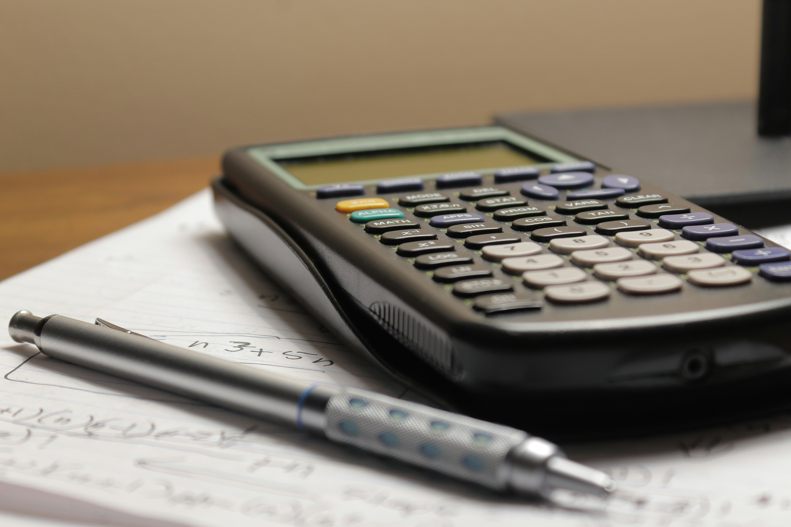
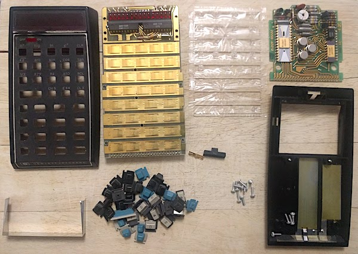

<!-- _class: lead -->

# CALCULATOR
**Englist for science**
**Course:**
SU218 Section 2010

---

<!-- _header: "Table of Contents"-->
1. What problem does it solve?
2. Who is it designed for?
3. What does it look like?
4. What components does it have?
5. How does it work?
6. How does it help users?

---

<!-- _header: "What problem does it solve?" -->
 - When we need too calculate something  like a number or equation and that too hard for calculate with my self 

---

<!-- _header: "Who is it designed for?" -->
 - studen / seller / teacher / business or scientist 
---

<!-- _header: "What does it look like?" -->
 - Its look like a phone but not its small and easy to carry every where , it have a button number or Mathematical variable  its has screen on front top 

---

<!-- _header: "What components does it have?" -->
 - It can help to calculate number or equation that sometime its to hard to calculate with your self 

---

<!-- _header: "How does it work?" -->
 - When you want to use , you open it and press the button in front and calculate you can press any button ,you look at button you can see the number in front and now you get the answer

---

<!-- _header: "How does it help users?" -->
 - It help user more faster and easier to calculate number or equation make your life easier

---
<!-- _header: "Members" -->

1. นายครรชิตพล สว่างศรี 680710554
2. นายพันธกร บุญยะเดช 670710092