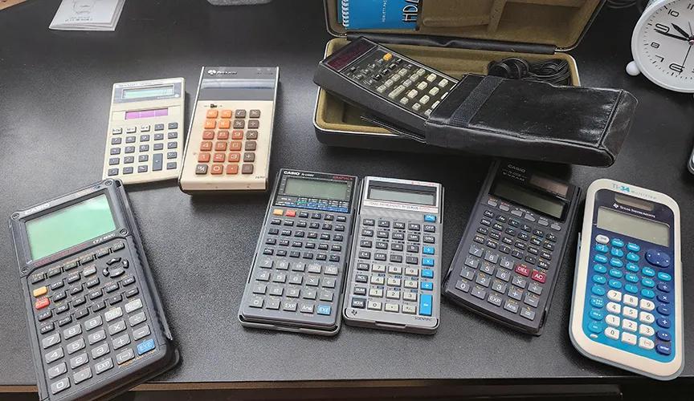
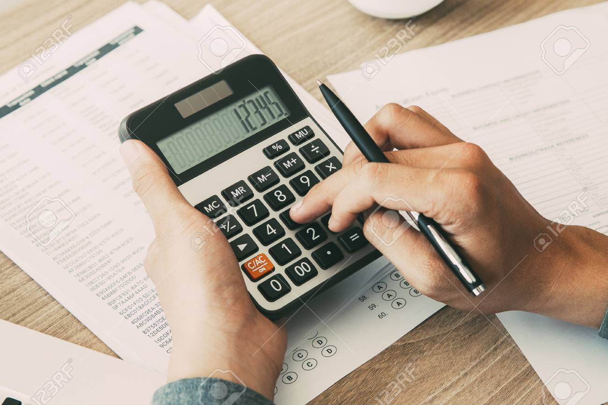

<!-- _class: lead -->

# CALCULATOR
**English for science**
**Course:**
SU218 Section 2010

---

<!-- _header: "Table of Contents"-->
1. What problem does it solve?
2. Who is it designed for?
3. What does it look like?
4. What components does it have?
5. How does it work?
6. How does it help users?

---

<!-- _header: "What problem does it solve?" -->
- Slow calculations
- Human errors
- Time-consuming

---

<!-- _header: "Who is it designed for?" -->
- Students
- Office workers
- Shop owners
- Cheft
- Everyone
---

<!-- _header: "What does it look like?" -->
- Small & rectangular
- Lightweight
- Digital screen
- Number buttons

---

<!-- _header: "What components does it have?" -->
- Screen
- Button number
- Symbol button
---

<!-- _header: "How does it work?" -->
- Open
- Press button number 
- Use math symbol
- Press equal to answer
---

<!-- _header: "How does it help users?" -->
- Calculate equation
- Calculate number for saler
- Calculate ingredient for cook
---
<!-- _header: "Members" -->

1. นายครรชิตพล สว่างศรี 680710554
2. นายพันธกร บุญยะเดช 670710092